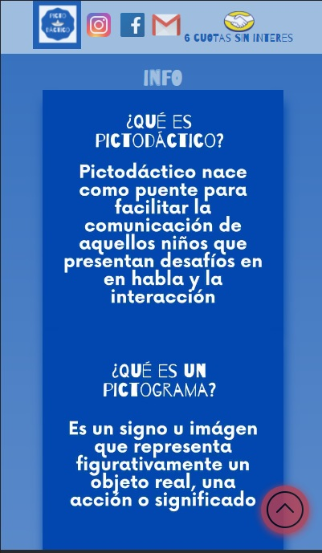

## Table of contents

- [Overview](#overview)
  - [Screenshot](#screenshot)
  - [Built with](#built-with)
  - [Autor](#autor)

## Overview
Pictodactico.com es una web estática que sirve para presentar el organizador visual, (Información, contenido, redes sociales). Dicha web estará en cambios recurrentes para mejorar la estética de la misma y agregar otras funcionalidades.

### Screenshot

### Links

- Live Site URL: [Pictodactico Web](https://pictodactico.com)

### Built with

- Semantic HTML5 markup
- Flexbox
- CSS Grid
- SCSS
- JavaScript
- Responsive design

## Autor

- Github - [lsminobagit](https://github.com/lsminobagit)
- Linkedin- 
